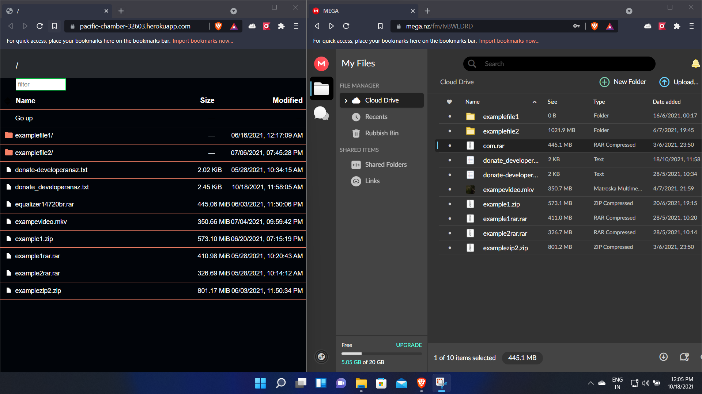
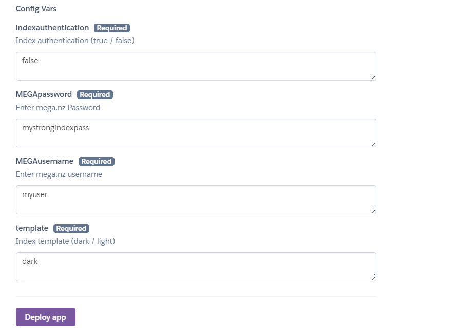
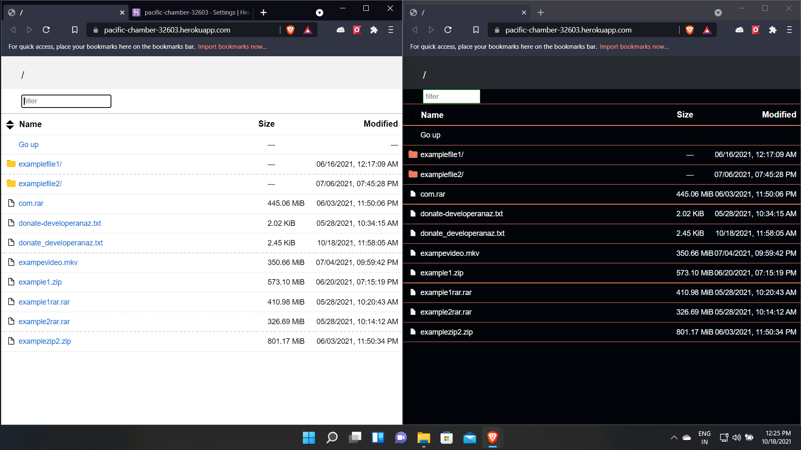
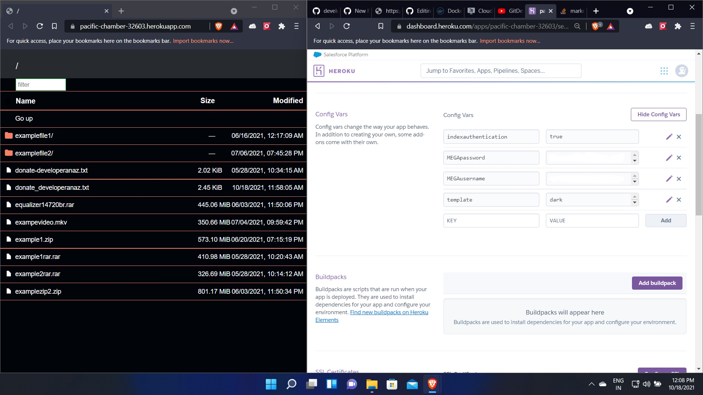
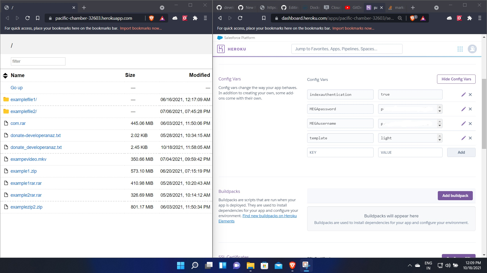

<h1 align="center" style="margin-top: 0px;"><ins> MEGA.NZ RCLONE INDEX HEROKU </ins></h1>
Mega Index Serves mega.nz to http using Rclone in heroku web. This creates a backdoor for mega storage and serves publicly And it has some other benefits like quota bypass, download stability, download through any download manager and speed boost.
This has also a feature of webdav, allowing you to download and upload files. Now added with new index authorisation feature ie ., lock your index using your mega userid and password, this feature is optional because some users need unauthorized index for quotabypass and muchmore



## Deploy

Heroku Rapid deployment without forking or github account. [](https://github.com/developeranaz/Mega.nz-Rclone-Index-Heroku/tree/developeranaz-patch-1)


Zeet Rapid deployment [](https://deploy.zeet.co/?url=https://github.com/developeranaz/Mega.nz-Rclone-Index-Heroku)

Use your  Mega Username/Email and Password normally.This index is free for every one and this uses rclone to index your mega files. The username and password you are given are safe and couldn't be accessed by me, ie., its completely safe  

STAR & FORK MY REPO IF YOU LIKE IT OR FOLLOW ME ON [INSTAGRAM](https://www.instagram.com/t_h_e_anas).
Project completed but still under development


------------

### Config Variables in heroku

Go to `settings` of deployed application > `reveal Config Vars` > `Edit` Button
Change Config Vars in settings of deployed application, change Email, password, indexauthentication and template for swiching accounts



REQUIRED CONFIG VARS

`indexauthentication` = `true` or `false`

`MEGAusername ` = `yourmega@email.com`

`MEGApassword` = `yourstrongpassword`

`template` = `dark` or `light`


## How to deploy?
### Basic
1. Click on this Rapid deployment Button [](https://heroku.com/deploy?template=https://github.com/developeranaz/Mega.nz-Rclone-Index-Heroku)
2. Fill your MegaUsername and MegaPassword
3. Fill indexauthentication type ``` true ``` or ``` false ```
4. Click on deploy
5. After deploying the application you can start using your index.

### How to add Additional password for your Index website
1.After deployment complete Go to `settings` of deployed application > `reveal Config Vars` > `Edit` Button in Heroku


------------
### Features
* Index Authentication Added
* Switch Dark and Light INDEX in config vars 
* No rclone.conf file needed
* Added More security
* MEGA support is available
* Switch your mega accounts in config vars
* No internet speed capping ,Enjoy Maximum download speed
* 24x7 permanent link
* No download limit or quota limit
* pause download available (Use download Managers like ADM ,XDM, Aria2 for more stability)
* Multi-thread support upto 9x (stable)

### Known Issues
* In some devices ,speed drop was detected. Please use  ADM /FDM /Aria2 For android OR Aria2 For windows / XDM for best Downloading speed


[](https://heroku.com/deploy?template=https://github.com/developeranaz/Mega.nz-Rclone-Index-Heroku)
[](https://deploy.zeet.co/?url=https://github.com/developeranaz/Mega.nz-Rclone-Index-Heroku)

---







### Tutorial of will be published soon

### Donate me 😊

###### Thanks To github.com/rclone/rclone

###### megaindex mega.nz index mega index meganzindex meganz index mega nz mega storage megamount mount gdrive drive mega link pause resume megalink megalinkindex Bhadoo Cloud indexing downloader quota meganzquota bypass mega.nzquata meganz uploader permenant-link index megaquota

<meta name="googlec978fa026335d582.html meganz index mega.nz index meganzindex" content="...">
<meta name="google-site-verification: googlec978fa026335d582.html" content="...">
